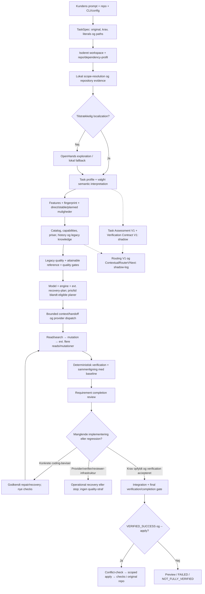

# Koda: hele processen fra kundens prompt til modelvalg, verification og apply

**Status: den lokale kode den 6. oktober 2026.** Dokumentet beskriver implementeringen, ikke et forslag til en ny arkitektur. Konfiguration, task og tilgængelig evidens bestemmer, hvilke grene der køres. Det er ikke en garanti for, at enhver task kan løses eller at checks beviser alle brugerens forventninger.

## 1. Det vigtigste først

Koda vælger normalt ikke blot den billigste model. Den forsøger at vælge en model **og en execution-plan**, som opfylder den eksisterende kvalitetspolicy, og optimerer derefter pris og tid.

**Produktionens specialistvalg styres af `LegacyProductionRouter`.** Routing V1 og ContextualRouterVNext er separate shadow-systemer. Deres beslutninger logges, men bliver ikke brugt til normal dispatch eller recovery. En VNext-prediction med offentlig support betyder ikke, at VNext har valgt produktionsmodellen.

`VERIFIED_SUCCESS` er det endelige resultat af checks, baseline-sammenligning og completion-gates. Det er ikke en modelprediction. `quality=.94` er en estimeret routing-score; det er ikke et observeret bevis for 94% succes på kundens task.

`--apply` er et særskilt trin. Uden det kan et verificeret resultat ligge i et isoleret workspace med `apply=preview`, mens brugerens repo er uændret.

## 2. Hele forløbet



Diagrammet viser ansvar, ikke en obligatorisk ekstra modelcall i hvert felt. En lille direct-task kan springe betalt exploration og planner over. En planned-task har flere workers og integrationschecks. Completion review kan være deterministisk og kan i nogle grene ligge før de udskudte final-checks.

## 3. Hvad der sker, når kunden sender prompten

### 3.1 CLI, konfiguration og transport

`bin/koda.mjs` starter CLI'en i `src/cli.ts`. Run-optionerne og `src/config.ts` bestemmer bl.a. repo, budget, parallelitet, timeouts, context-størrelse, modelpool, specialist/adaptive routing og eventuel `forceModel`.

Der er ikke kun én universel modelvalgsgren:

| Situation | Aktivt modelvalg |
|---|---|
| Specialist routing med modelpool og uden forced/eksplicit model | `PoolRouter.selectExecutionPlan` / joint-plan via legacy-specialistoptimering |
| Normal pool-stage selection, fx visse planning/review/fallback-kald | `PoolRouter.select` → `rankCandidates`; separat enklere legacy-ranking |
| Adaptive coding slået til, specialist routing fra | `codingDemand`, adaptive tier og Pareto-route; frontier rescue hvis relevant |
| `forceModel`, eksplicit model eller allerede valgt plan/candidate | Den eksplicitte/prevalgte model; det efterfølgende provider-kald har stadig runtime bounds |
| Fake-provider i test/dev | Scriptet testtransport; ikke en måling af en rigtig models kvalitet |

Ved bundled modelpool slår config-loaderen som udgangspunkt adaptive/specialist coding til; eksplicitte config-værdier kan ændre det. De rene schema-defaults alene beskriver derfor ikke altid den effektive standardinstallation.

Derfor skal man læse runnets effektive config og events, ikke kun et modelnavn, for at afgøre præcis hvilken branch der blev brugt.

Default provider-mode er `backend`. `src/provider/transport.ts` gør `KODA_API_URL` autoritativ og tilføjer `/v1`. Default er `http://127.0.0.1:8787/v1`. Klienten bruger den ikke-hemmelige placeholder `koda-backend-client`.

```text
Koda lokal klient
  → Koda backend: OpenAI-compatible request + placeholder
  → OpenRouter: backendens egen OPENROUTER_API_KEY
  → response/usage/error tilbage til klienten
```

Backend-proxyen i `src/backend/proxy.ts` bruger serverens nøgle, ikke klientens credential. Den laver upstream-auth preflight og markerer fejlens origin med `x-koda-error-origin`. Streaming videresendes på streaming-stierne. Det normale Agentic request er selv non-streaming.

Kun eksplicit `KODA_PROVIDER_MODE=direct-openrouter` giver klienten adgang til den lokale OpenRouter-key. Aider/OpenHands bruger den fælles transports base URL og generisk OpenAI-compatible LiteLLM-modelprefix i backend mode; routed model-ID'et bevares bag prefixet.

### 3.2 TaskSpec bevarer den originale opgave

`compileTaskSpec` i `src/planner/taskSpec.ts` opdeler prompten i unikke requirement-clauses og registrerer:

- original prompt og SHA256-hash;
- mål og krav;
- constraints og acceptance criteria;
- exact literals og eksplicitte paths;
- bounded requirement-grupper (`parts`) og `routingPrompt`.

Originalen er autoritativ. Hele en stor prompt bliver ikke automatisk kopieret ind i alle modelkald. Flere grupper skal udføres gennem decomposition/planning. En enkelt udelelig requirement over TaskSpec-grænsen giver en eksplicit decomposition-fejl; koden foregiver ikke, at en trunkeret requirement er implementeret.

TaskSpec er en deterministisk tekststrukturering. Det er ikke i sig selv fuld semantisk forståelse; fx constraints/acceptance extraction har konkrete sproglige mønstre.

### 3.3 Workspace og repository-profil

`run()` i `src/run.ts` opretter run-ID, output-folder og workspace-backend. `src/workspace/backend.ts` understøtter clean Git, dirty Git og non-Git folders. Arbejdet foregår på et isoleret udgangspunkt, der også kan bevare eksisterende lokale ændringer.

`profileRepo` og repo/ecosystem-koden finder filer, sprog, frameworks, package manager, projektgrænser og deklarerede checks. Dependencies kan genbruges/bridges eller bootstrap'es. Dette kan koste tid før den første modelcall.

Runnet opretter en fælles `Budget`, `Gateway` og eventuel `PoolRouter`. Modelsnapshot fryses for runnet. Modelvalg bruger normalt lokalt cachet metadata; et ægte cold start uden priser kræver catalog-acquisition.

### 3.4 Localization før coding

Koda prøver først hurtige repository-backed veje: `fastPathExploration`, `boundedTextEditExploration` og `deterministicRepositoryExploration`. Entydigt lokalt bevis kan gøre en betalt repository-explorer overflødig.

Ved utilstrækkeligt scope bruges normalt `OpenHandsExplorer`. En operational exploration-fejl kan give lokal fallback, men en fallback uden et etableret implementation-target er ikke automatisk tilladelse til at skrive vilkårlige filer.

Localization finder editable filer, readonly evidence, relaterede tests og confidence. Et navn i et search-resultat er et discovery-hint, ikke nødvendigvis et læst implementation-bevis.

Write scope og read scope er forskellige. Related tests er ikke automatisk editable. Eksplicitte brugerrestriktioner er autoritative. Scope-expansion skal have konkrete repository-/requirement-beviser; parallelle workers må ikke skrive i overlappende scopes.

## 4. Task understanding: hvilke repræsentationer findes?

| Repræsentation | Funktion | Autoritet nu |
|---|---|---|
| `DeterministicTaskProfile` | Repo-backed family, targets/tests/components, localization og risks | Indgår i eksisterende production flow |
| `interpretTask` / semantic assessment | Valgfri bounded semantisk vurdering | Eksisterende interpretation-branch; afhænger af config |
| `TaskAssessmentV1` | Separate dimensioner, confidence og evidence | Logges som `mode=shadow`; ikke globalt aktiveret som ny production policy |
| `Features` | Context bytes, check count, task kind, complexity m.m. | Bruges af stage-ranking, history og økonomi |
| `TaskFingerprint` | Detaljeret task/engine/scope/risk/proof-beskrivelse | Bruges direkte af specialistoptimering og recovery |
| `VerificationContractV1` | Requirement-by-requirement plan for proof | Shadow-kontrakt; udfører ikke selv checks og afgør ikke completion |
| `CanonicalRoutingTask` | Adskilt VNext input med task/proof/risks/semantics | VNext shadow og offline evaluering |

Disse er forskellige versioner af taskforståelse. Man må ikke antage, at et V1 assessment-felt automatisk erstatter det tilsvarende production-fingerprint-felt.

Fingerprintet omfatter bl.a. task family, primary/secondary capabilities, sprog/framework, scope, change size, effort, semantic complexity, coupling, localization uncertainty, public API/schema/config/security/concurrency/architecture-risici, verification strength, false-accept risk, recovery detectability og contextkrav.

Risiko og sværhedsgrad er adskilt: en lille sikkerhedsrettelse kan være teknisk let, men kræve stærkere final-verification og strammere quality-policy.

`chooseExecutionStrategy` og `allowedJointExecutionStrategies` bestemmer, hvilke direct/stable/planned muligheder der må sammenlignes. Et bounded direct-workstream skal ikke gøres til et bredt agent-loop alene fordi en anden loop-type ser billigere ud.

## 5. Præcis hvordan produktionsmodellen vælges

### 5.1 Den konkrete specialist-kaldesti

```text
run.ts: selectJointExecutionPlan når joint selection bruges
  → modelRouter.ts: PoolRouter.selectJointExecutionPlan
  → PoolRouter.selectExecutionPlan for tilladte engine-varianter
  → CapabilityRegistry.forTask + Catalog + History
  → LegacyProductionRouter.decide
  → routeOptimizer.ts: optimizeSpecialists
  → selectQualitySafeJointPlan på tværs af engine-planer
  → frozen execution policy / initialCandidate
  → codingExecutor.ts: implement
  → valgt worker og faktisk provider-dispatch
```

CodingExecutor kan selv kalde `selectExecutionPlan`, hvis ingen færdig plan er leveret. En preselected plan skal ikke forveksles med et nyt VNext-valg.

### 5.2 Discovery og teknisk kompatibilitet

Registry/catalog samler configured/discovered kandidater og faktuelle capabilities. Pris, context window, max output, parameter-/tool-support, availability og enabled-status påvirker kompatibilitet. Budget og deadline påvirker, om kandidaten faktisk kan køres.

Der er også eksisterende policy-filtre: free/batch endpoints, frontier-justification og observeret Aider edit-format inkompatibilitet. Tool-protokolkrav varierer mellem engines. En model kan derfor være god generelt, men uegnet til det konkrete Aider/Agentic/request-format.

Ingen pris eller inkompatible tools er execution-/metadata-problemer, ikke et empirisk bevis på dårlig coding-kvalitet.

### 5.3 Legacy-kvalitet: kilder og fusion

Specialist-estimatoren bruger `estimateQuality` fra `src/router/knowledge/estimator.ts`, derefter taskjustering og relevant lokal historik i `routeOptimizer.ts`.

| Kilde | Hvad den bidrager med |
|---|---|
| Configured `qualityPrior` | Legacy udgangspunkt; ikke observeret solve rate |
| Configured strengths og tiers | Task-affinity, policy/shortlist/referencebegrænsninger |
| Public benchmark/knowledge evidence | External estimates med identity-, task-, language-, freshness- og sourcevægt |
| Valideret legacy contextual knowledge matrix | Kan give task-aware estimates/paired regret i legacy subsystemet; er **ikke** ContextualRouterVNext |
| Relevant VERIFIED_SUCCESS-historik | Vægtet lokal kvalitetsevidens |
| Attribuerbare coding failures/regressions | Negativ lokal kvalitetsevidens; operational failures filtreres |
| Engine/provider operation history | Latency, reliability og execution-format; separat fra coding quality |
| Efficiency history | Forventet attempt-/completion-tokenforbrug, cost og tails |
| Paired recovery outcomes | Conditional rescue når support er tilstrækkelig |

Forenklet, men direkte fra specialist-koden:

```text
external = estimateQuality(configuredPrior, fingerprint, knowledge, evidence, model)
prior = external.mean + task-strength bonus - semantic/coupling/localization demand adjustment
externalWeight = 10 / 6 / 4 afhængigt af confidence
quality = (prior × externalWeight + weightedSuccesses)
          / (externalWeight + weightedSuccesses + weightedFailures)
```

Relevant historik vægtes efter task-region, target/scope, sprog, difficulty og engine. Succes med acceptance checks får stærkere vægt end generisk succes uden task-checks. Coding failures får mindre vægt end successes. Konservativ kvalitet kommer fra external bound og/eller lokal beta-bound; det er ikke universelt `mean - uncertainty`.

Tallene er legacy-modellering. De udgør ikke en kalibreret garanti for frontier-paritet eller for at et nyt benchmark-modelnavn svarer til den aktuelle endpoint-version.

### 5.4 Reference og kvalitet før økonomi

Optimizer vælger den stærkeste **attainable** reference blandt kandidater, der faktisk kan køres under de aktuelle constraints. Den sorterer reference efter konservativ kvalitet, mean, cost og stabil model-ID tie-break.

Reference betyder derfor ikke nødvendigvis verdens bedste model eller Codex. Hvis en stærkere model ikke kan køre inden for deadline/policy/context/budget, kan en anden model definere reference.

Planer kan være en enkelt model eller initial model + rescue. Der beregnes mean/conservative final quality, quality gap/regret, first-attempt floor, forventet escalation, cost/token/latency tails og eligibility.

Den aktuelle legacy-regret-policy bruger config plus verification/risk-grænser: normal regret er højst `.012` ved weak verification eller `.025` ellers, og high risk halverer den. `boundedDiscovery` har en særskilt eksisterende policy, der kan tillade mindst `.2`. Dette er heuristiske legacy-policygrænser, ikke measured uncertainty fra VNext.

En billig førstegangstrial har særlige betingelser: stærk/fokuseret verification, tilstrækkelig localization, bounded blast radius og passende risk/detectability. Coding-kvalitet og final-checks må ikke sænkes for at få billigere output.

### 5.5 Rescue-modellering

Ved tilstrækkelig relevant paired history bruges en conditional recovery rate. Der antages ikke blindt uafhængighed mellem modeller. Uden tilstrækkelige pairs bruges i legacy-planen en begrænset kvalitetsgevinst fra rescue, når policy giver targeted recovery coverage.

```text
P(final) ≈ P(initial) + (1 - P(initial)) × P(rescue | initial coding failure)
E(cost) ≈ initial attempt cost + P(escalation) × rescue attempt cost
```

Det er planestimater. Den faktiske rescue bliver først kørt, hvis failure evidence og frozen recovery-policy tillader det.

### 5.6 Pris/tid vælger mellem quality-eligible planer

Økonomien vurderer hele attempt-/completion-planen, ikke blot dollars pr. million tokens. Expected usage, gentagne kald, recovery probability, P90/P99 tails, latency, deadlines, remaining budget og cost per verified completion indgår.

`selectQualitySafeJointPlan` filtrerer cross-engine konservativ quality parity og sorterer derefter på optimizer score, latency, cost per solve og stabil model-ID tie-break.

Den enklere `rankCandidates` til pool/stage-valg har sin egen prior/history-formel og normaliserede `costWeight`/`latencyWeight`. Når en kandidat når preferred quality target, prioriteres den gruppe; hvis ingen gør, rangeres efter højeste estimerede kvalitet. Det er ikke samme estimator eller gate som specialist-planoptimeringen.

Eksempelkonfigurationen har routing `minimumQuality=.9`, `costWeight=.55`, `latencyWeight=.45`, `priorStrength=10`. Det er **eksempelconfig**, ikke bevis på den effektive config i enhver installation.

## 6. De tre router-systemer og deres grænser

| System | Kvalitetsgrundlag | Normal dispatch nu |
|---|---|---|
| LegacyProductionRouter | Priors, legacy public knowledge, weighted local history, specialist policies | **Ja**, for specialist-grenen |
| Routing V1 | Egen empirical evidence/priors-ledger og quality-planoptimering | Nej; shadow |
| ContextualRouterVNext | Canonical task/outcome artifact, source provenance, relevant public/native task evidence og paired outcomes | Nej; shadow |

VNext modtager rå model-facts og canonical evidence. Det må ikke bruge legacy `qualityPrior`, specialist-posterior, attainable-reference-score eller tiers som sin kvalitetssandhed. `LegacyProductionRouter` og VNext producerer separate beslutninger.

`src/router/routingAuthority.ts` har en eksplicit authority-switch-funktion. Dens eksistens er **ikke** en global production-activation: den normale specialist-kaldesti kalder legacy direkte og logger V1/VNext efterfølgende. Shadow on/off skal bevare samme production selection/recovery. VNext `ABSTAIN` bliver ikke omdannet til en legacy-selection inde i VNext.

### 6.1 VNext cold-start lige nu

`contextualShadowDecision` læser et canonical artifact fra den canonical evidence-directory. `withColdStartEvidence` supplerer med det pakkede `contextual-cold-start-v1.json.gz`. Public artifact indlæses/cache's; store rå benchmarks scannes ikke på hvert brugerrequest. Relevant lokal native evidence kan erstatte matching native cells i den frosne fit.

VNext registrerer public/native support, provenance, retrieval-neighbors, model-/version-/family-transfer og calibrated domain. Offentlig support er nu tilgængelig ved cold start uden lokal brugerhistorik.

**Den resterende begrænsning:** public support er ikke automatisk kalibreret Koda-transfer. `contextualQuality.ts` returnerer fortsat en bred `[0,1]` Koda-usikkerhedsgrænse, når `calibratedDomain=false`; planselektion kan derfor ABSTAIN selv med public support. I normal shadow-kørsel tilføres ingen kalibrerede Koda-verifier-målinger eller målte latency-facts, så generelle project-checks giver ikke vilkårlig rescue-credit.

Det isolerede eksperiment under `research/cold-start` er offline forskning i public unseen-task routing. Det indgår ikke i VNext-dispatch, produktionshistorik eller production quality-estimation.

## 7. Hvordan benchmarks faktisk påvirker modelvalg

Benchmarks virker ikke som et live opslag: “find den billigste model, der løste netop kundens prompt”. Der er flere adskilte dataveje:

1. Legacy ingestion/snapshot-validering kan levere public knowledge til legacy-estimatoren. Kun den snapshot, den aktive state faktisk læser, påvirker den konkrete selection.
2. Routing V1 bruger egne priors/evidence. En legacy knowledge-fil bliver ikke automatisk V1 observationer.
3. VNext bruger canonical adapters og et frosset cold-start artifact. Holdout/synthetic/censored data må ikke blive training-quality-evidence.
4. Native calibration kan skabe canonical evidence, når actual served model, task, engine/harness, uafhængig acceptance og failure attribution er tilstrækkeligt dokumenteret. Et provider-kald eller en tom usage-row er ikke en succesobservation.
5. `benchmarkCompare.ts`, `realBenchmark.ts` og øvrige live harnesses måler resultater. Deres eksistens eller et positivt solve-tal aktiverer ikke VNext globalt.

`routerStateDirectory` er eksplicit config-directory eller `~/.koda/model-router/<hash af config.baseUrl>`. Backend og direct transport kan derfor læse forskellig legacy history/knowledge. Det canonical VNext artifact har en separat loader. Installeret data og aktivt anvendt data er to forskellige ting.

Public model-ID, family-transfer og nøjagtig served model-version er heller ikke det samme. Priser/capabilities er facts; public cross-harness solve rates er transfer-evidence med begrænsninger.

## 8. Context, dispatch og selve kodningen

`compileTargetContext`, `compileContext` og handoff-planneren bygger en bounded coding-packet med requirements, editable paths, readonly evidence, file content og nødvendige checks. Relevant context er ikke lig med write authorization.

Budgetbegreberne er adskilt:

| Begreb | Formål |
|---|---|
| Provider context window | Input + output skal passe i den valgte models capacity |
| Per-call input/output bound | Forhindrer ét enormt request |
| Attempt token/cost/time budget | Grænse for workerens samlede forsøg |
| Run budget | Samlet discovery/planning/coding/recovery/review-forbrug |
| Reservation | Midlertidigt sikkerhedsbudget før provider-call; erstattes af actual usage hvor rapporteret |

`packetPolicy.ts` har nu 32.768 input-token bound, 4.096 output-token bound, 32.768-byte coding-packet og 6.000-byte TaskSpec-gruppe. `providerPayloadBound` bruger `ceil(serialized UTF-8 bytes / 3) + 256` som tokenizer-uafhængigt fallback. Det er et konservativt **estimat**, ikke et faktisk provider-tokenizer-resultat.

En vigtig aktuel detalje: legacy optimizer beregner economic input med `contextBytes/4 + 256`, men har stadig et særskilt reservation-input med `contextBytes + 256`. Det er ikke den samme beregning som den endelige payload-bound. Dokumentet ændrer ikke denne implementering og påstår ikke, at forecasts er perfekt kalibrerede.

`codingCapacity` reserverer plads til recovery/review gennem lavere førstegangs-capacity. Store packets skal shrinkes/compacted eller decomposes, før de forsøges som ét kald. Exact requirements må ikke forsvinde under compaction.

Der findes DirectEdit-, Agentic-, Aider- og Stable-workers. Top-level strategy-navnet `direct` betyder ikke ubetinget “DirectEdit-engine”: logget faktisk engine/provider skal læses særskilt.

Agentic udfører read/search, mutation og ved behov flere reads/mutationer. Eksisterende mutation-targets har read-beviser; search alene tæller ikke som en rigtig `read_file`. `returnOnMutation` kan returnere control til Koda efter første successful mutation for en lille task. Verifikationens brede checks er Kodas ansvar; workerens exit-message er ikke final success.

Aider kører gennem TS executor → Python bridge/subprocess → Aider/LiteLLM. Faktisk/fallback prompt-token accounting, model output/context caps og actual usage indgår. Hvis DirectEdit/Aider-packet ikke kan passe eller output-protokollen fejler, kan bounded Agentic på samme model være en execution-mode fallback, før en model-escalation giver mening.

## 9. Verification: hvilke checks køres og hvorfor?

### 9.1 Baseline først, når der skal sammenlignes

Koda kan måle samme authoritative checks på baseline og kandidat. Der sammenlignes command, cwd, failure signatures og relevante changed paths. En eksisterende fejl, som kandidaten ikke forværrer, er ikke automatisk en ny modelregression.

Baseline-failure betyder ikke, at repoet er grønt. Den skal være dokumenteret som uændret og vises i resultatet. Manglende baseline-verification må ikke opfindes som PASS.

### 9.2 Planlagt contract versus observeret proof

`buildVerificationContract` beskriver proof-methods, requirement strength, false-accept risk, critical/blocking flags, confidence og required project checks. Proof kan være available, planned eller manual.

Kontrakten logges shadow. Den udfører ingen commands. Det faktiske production-resultat afgøres af verifier, completion review og final gate. Planned typecheck er ikke observed typecheck PASS; observed typecheck PASS er ikke nødvendigvis bevis for en UI- eller adfærdsrequirement.

### 9.3 Selection bruger faktiske ændringer

`verificationPlan` finder project checks; `focusedVerificationCheck`, `verificationImpactRelationships` og `impactAwareVerificationSelection` vurderer, om impact kan indsnævres.

| Faktisk ændring | Mulig fokuseret verification |
|---|---|
| Testfil, der matcher opdaget runner-glob | Kør den præcise test gennem repoets runner + nødvendige structural checks |
| Source med inspiceret import-relation til tests | Kør de påviste impacted tests + nødvendige structural checks |
| Source uden sikkert afgrænset testimpact | Bevar broad/full checks |
| Dependency/config/schema/migration eller højrisiko/cross-component | Broad verification kan være nødvendig |
| Nye filer / stale pre-edit profile | Reprofile og `recoverPostMutationChecks` på det muterede workspace |

Nye tests skal følge faktisk runner/convention. `tests/*.test.ts` autoriserer ikke automatisk en test under `src/`. Explicit bruger-/benchmark-checks tilføjes særskilt og må ikke fjernes, fordi internal selection finder et snævrere check.

Sikkert fokuserede ændringer kan undgå at gentage aggregate full-test entrypoints. Checks må kun genbruges, når deres accepterede candidate-state/change-manifest stadig matcher; en ny mutation kræver relevante nye checks.

### 9.4 Command-resultater og statuses

`verify` i `src/verifier/verifier.ts` kører commands i verification-miljø, begrænser timeout, klassificerer environment-/runtimefejl og kan retry'e operational verification. Den seneste authoritative retry-result bruges som check-resultat.

| Check outcome | Betydning |
|---|---|
| `CHECK_PASS` | Command bestod |
| `CHECK_FAIL` | Reelt checkfailure; vurder baseline/regression |
| `CHECK_UNAVAILABLE` | Check kunne ikke udføres |
| `INFRA_FAILURE` | Miljø, sandbox, netværk eller verifier-infrastruktur svigtede |

Den almindelige `verificationResult` giver `FAILED` ved CHECK_FAIL, `NOT_FULLY_VERIFIED` ved manglende/required unavailable evidence eller tomme/no-op checks, ellers `VERIFIED_SUCCESS`.

Baseline-comparison kan markere `baseline_unchanged`, `CANDIDATE_NEUTRAL` eller `CANDIDATE_IMPROVEMENT`. Den nuværende `completionReviewGate` kan promovere de to baseline-relative candidate-statuses til VERIFIED_SUCCESS, når ingen completion reviews er unresolved. Det er **baseline-relativ taskacceptance**, ikke en erklæring om, at alle eksisterende repo-checks blev grønne. Baseline-failures og observed check-outcomes skal fortsat læses i rapporten.

Verifieren overvåger source-mutation. En command, som ændrer beskyttet source under verification, giver required `verification_source_mutation` / INFRA_FAILURE og er ikke grundlag for coding repair. Tilladte build/cache-artefakter håndteres særskilt.

## 10. Completion review: lavede kandidaten kundens opgave?

Completion review sammenholder requirement-checklist med candidate diff, actual changed paths, symbols, bounded repository evidence og verification-resultater.

For en entydig grounded literal-rettelse kan `deterministicLiteralCompletionReview` bevise completion uden en ekstra reviewer-modelcall. Ellers bruges en bounded modelreview; modellen kan være implementerings-/reviewmodellen efter den eksisterende policy, ikke nødvendigvis den samme model som explorer/planner.

Malformed/unstructured reviewer-output får én strict structured retry. Hvis også den fejler, er det reviewer/protocol infrastructure failure. Det er ikke en liste over “alle krav mangler”, og må ikke starte scope-expansion eller coding repair.

Coding completion repair kræver konkrete manglende requirements. Review må ikke kræve, at kandidaten fikser alle pre-existing failures. Hvis final checks er udskudt, kan review vurdere implementeringen uden at foregive, at checks allerede bestod; de efterfølgende resultater gate'er final success.

`no_changes_required` skal understøttes af task-specifikt eksisterende implementation-/test-/literal-bevis. Generisk baseline typecheck-PASS er ikke tilstrækkeligt bevis for, at en eksplicit implementeringsopgave allerede er løst.

**UI-begrænsning:** lint, typecheck og build beviser ikke alene farver, spacing, klikflow eller om en kontaktside er nyttig. Review-prompten kræver consideration af CSS cascade, men kodebaseret review er ikke det samme som observeret browser-rendering. Dokumentet påstår ikke, at hvert normalt run udfører screenshot/DOM/computed-style validation.

## 11. Recovery og learning

Koda klassificerer failure, før den vælger næste handling:

| Failure | Typisk håndtering | Negativ model-quality-evidence? |
|---|---|---|
| 429, timeout, 5xx, connection/provider auth | Transportretry, godkendt operational fallback eller stop | Nej |
| Output-limit, unsupported tool/JSON/edit protocol, preflight-packet | Shrink/compact, mode fallback eller godkendt operational recovery | Nej i sig selv |
| Discovery uden passende scope eller manglende miljø | Discovery/environment recovery eller explicit stop | Nej i sig selv |
| Ny deterministisk regression | Konkret coding repair/escalation inden for policy | Ja, når attribuerbar |
| Requirement faktisk mangler | Completion repair på konkret scope | Ja, når evidence er tilstrækkelig |
| Reviewer malformed eller verifier source-mutation | Infrastructure failure; ingen blind coding repair | Nej |

`freezeExecutionPolicy` og `chooseAdaptiveRecovery` fastholder godkendt candidate-board, required quality, quality cascade, operational recovery og attempt-budget. Operational recovery behøver ikke gå til en større tier; den foretrækker en passende billig/reliable compatible kandidat, som stadig overholder frozen quality-contract. Coding recovery bruger faktisk coding evidence og skal ikke downgrade uden grundlag.

Localization/evidence og relevante mutations skal bevares gennem recovery. Et mislykket forsøg betyder ikke, at korrekt candidate source skal slettes. History-/Failure Attribution-koden adskiller coding quality fra operational, environment og execution-efficiency.

Efter runnet registreres requested/served model, usage/cost, engine, timing, verification og attribution, når de findes. Fake-provider telemetry er synthetic og må ikke opdatere real-model quality/performance. Shadow-ledgers og production-ledgers er adskilte.

## 12. Final integration og apply

Planned workers integreres i fælles candidate workspace efter dependencies. Worker scopes skal være ikke-overlappende; integration/final checks vurderer den samlede ændring, ikke blot isoleret worker-success.

Efter final-verification og completion-gate gemmes den verificerede change-manifest. `backend.apply` får kun et verified flag ved VERIFIED_SUCCESS. Det omfatter modified, created og deleted paths inden for autoriseret scope.

Før apply kontrolleres originalens tilstand mod det isolerede udgangspunkt. Konflikt med brugerændringer giver explicit apply-conflict; Koda må ikke stille overskrive dem. Git/GitHub er ikke nødvendigt for filesystem-backenden.

Efter apply kontrolleres byte/hash/mode-match mod den accepterede kandidat. `verifyAppliedRepository` rerunner accepterede behavioral tests og det mindste accepterede structural check: typecheck foretrækkes, dernæst lint/build. Det genkører ikke automatisk hele build+lint+typecheck-pakken endnu en gang, når identisk candidate allerede er accepteret.

Hvis post-apply verification fejler, nedgraderes status, `apply=verification_failed` registreres og safe rollback forsøges. Resultatet kan derfor ikke blot beholde VERIFIED_SUCCESS efter en konstateret apply-fejl.

## 13. Hvorfor kan en enkel task stadig tage lang tid?

Wall-clock omfatter mere end workerens modelcall:

```text
workspace/dependency setup
+ repository profiling og localization
+ evt. explorer/semantic interpretation/planner-modelkald
+ catalog/routing og context/handoff
+ implementation-modelens ventetid og tool-loops
+ baseline/candidate checks
+ evt. reviewer/retry/repair/recovery
+ integration/final verification
+ apply og checks i original repo
+ rapportering
```

Mange test/build-entrypoints, dependency bootstrap, sequential retry, output/protocol failure, broad scope, svag task-proof eller et ekstra reviewer-call kan dominere. En model, der muterer på 7 sekunder, giver ikke automatisk et 7-sekunders run.

Cold-start evidence, catalog-cache, lokal fast-path, bounded context, targeted checks, deterministic literal review og korrekt check-reuse reducerer overhead i de grene, hvor beviset tillader det. Der findes ingen generel “maks 10 sekunder og altid korrekt”-garanti i den aktuelle kode.

## 14. Sådan aflæses et konkret run

Output ligger normalt under `~/.koda/runs/<run-id>/`. Se actual artifacts; nogle er branch-afhængige:

| Artifact/event | Hvad det fortæller |
|---|---|
| `task-spec.json` | Original task, grupper og constraints |
| `plan.json` / `dag` | Planned subtasks, dependencies og scopes |
| `task_assessment`, `verification_contract` | V1 shadow-forståelse og proof-plan |
| `joint_execution_route`, execution-route/model-router events | Faktisk legacy selection, eligible/rejected planer og begrundelser |
| `routing_v1_shadow_decision`, `routing_v1_shadow_joint_decision` | V1's separate forslag/abstention |
| `routing_contextual_shadow_decision` | VNext's separate SELECTED/ABSTAIN, candidates, support/provenance og artifact digest |
| `model_call`, `provider_payload_bound`, `provider_policy` | Request-stage, model, bounds og transportpolicy |
| `tool_result`, mutation/implementation events | Læst indhold og faktiske ændringer |
| verification/baseline/completion-review events | Observeret proof, regression og unresolved requirements |
| `latency` / `summary.json` | Målt timing, cost/usage og endelig status |
| `workspace.json`, apply events | Preview/applied/conflict og accepted change-manifest |

Skeln altid mellem **estimated**, **reserved** og **actual** cost/tokens samt requested og served model. Manglende accounting er ikke nul dollars. Sammenlign observerede stage-tider; de er ikke altid disjunkte og må ikke ukritisk summeres til wall-clock.

## 15. Kort kildeoversigt

Alle paths nedenfor er relative til Koda-repoet.

- Entry/run: `bin/koda.mjs`, `src/cli.ts`, `src/config.ts`, `src/run.ts`.
- Prompt/task: `src/planner/taskSpec.ts`, `src/router/taskProfiler.ts`, `taskInterpreter.ts`, `taskAssessment.ts`, `features.ts`, `taskFingerprint.ts`, `executionStrategy.ts`.
- Production routing: `src/router/modelRouter.ts`, `legacyProductionRouter.ts`, `routeOptimizer.ts`, `capabilityRegistry.ts`, `pool.ts`, `history.ts`, `controlPolicy.ts`.
- Evidence/economics: `src/router/knowledge/estimator.ts`, `store.ts`, `contextual.ts`, `efficiency.ts`, `canonical.ts`, `canonicalHistoryAdapter.ts`, `nativeCalibrationAdapter.ts`.
- Shadow: `src/router/routingV1.ts`, `routingV1History.ts`, `contextualShadow.ts`, `contextualRouterVNext.ts`, `contextualQuality.ts`, `contextualPlans.ts`, `pairedEvidence.ts`, `routingAuthority.ts`, `knowledge/coldStart.ts`.
- Context/execution: `src/context/compiler.ts`, `packetPolicy.ts`, `src/agent/handoffPlanner.ts`, `codingExecutor.ts`, `agenticCodingWorker.ts`, `directEditWorker.ts`, `aiderExecutor.ts`, `stable.ts`, `stableNoChangePreflight.ts`, `completionReview.ts`.
- Transport: `src/provider/transport.ts`, `src/openrouter/client.ts`, `catalog.ts`, `usage.ts`, `src/backend/proxy.ts`, `server.ts` og Python bridges i `workers/aider/bridge.py` og `workers/openhands/bridge.py`.
- Verification: `src/verifier/contract.ts`, `plan.ts`, `selection.ts`, `verifier.ts`, `recovery.ts`, `src/repo/commands.ts`, `dependencies.ts`.
- Apply: `src/workspace/backend.ts`, `files.ts`, `diff.ts`, `verification.ts`.

Dette dokument ændrer ingen modelvalg, thresholds, verification-gates eller runtime-adfærd. Det erstatter ikke run-specifikke logs: de afgør, hvilken af de beskrevne grene en konkret kundeopgave faktisk gennemløb.
