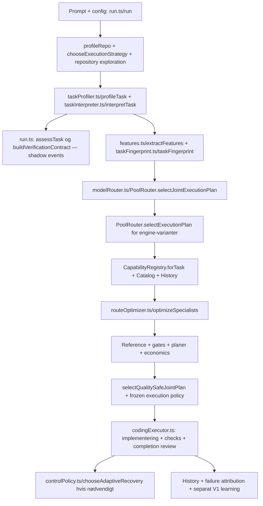
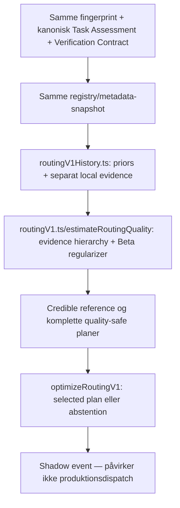

# Audit af den aktuelle Koda-routing

Dato: 6. oktober 2026. Read-only audit af kode, lokale state-filer og run-log.
Ingen produktionskode, heuristikker eller priors er ændret. Ingen modelkald er kørt.
Dette dokument er det eneste nye audit-artifact.

## A. CURRENT STATE — de vigtigste beviste fund

1. Produktion valgte Luna via den eksisterende specialist/joint-planoptimering.
   Routing V1 var shadow og abstained. Der er ikke tale om den samme estimator.
2. Der er faktisk installeret CodeRouterBench- og SWE-rebench-materiale lokalt.
   Det ligger under **direct-OpenRouter state**, ikke under den state, som det
   seneste backend-run læste. Ingestion-kommandoernes eksistens er ikke beviset;
   nedenstående filoptællinger og run-events er.
3. Luna var selv produktionens attainable reference. `quality_safe` betød derfor
   modelleret parity med denne reference, ikke dokumenteret parity med Codex/Opus.
4. Luna havde relevant lokal historik plus bundled SWE-transfer-evidence.
   De billige alternativer havde primært configured priors og stor usikkerhed.
5. V1 havde ingen prior-fil og ingen observationer før denne beslutning. Efter
   runnet blev én Luna-succes registreret; den er ikke nok til en credible reference.
6. **Den aktuelle `src/agent/attemptPolicy.ts` er 0 linjer.** Dagens source-tree
   er derfor ikke en eksekverbar reproduktion af det historiske successful run.
   De relevante exports og typecheck er brudt. Audit af historisk valg bygger på
   gemte events og eksisterende øvrig kode; jeg har ikke gendannet filen.

## 1. Bevisgrundlag og faktisk Luna-run

Run: `run-2026-10-05T23-30-19-917Z-c52cbe`.

- Repo: `/Users/madsflyvholm/Desktop/Zeppobridg`.
- Task: på kontaktsiden ændres “Kontakt os” til “Lad os tale sammen”; øvrigt design,
  links og funktionalitet bevares, og kun nødvendig tekstrettelse foretages.
- Scope: `src/app/kontakt/page.tsx`.
- Kilde: `~/.koda/runs/run-2026-10-05T23-30-19-917Z-c52cbe/events.jsonl`
  og den tilhørende `summary.json`.
- Resultat: `VERIFIED_SUCCESS`; én rapporteret Luna-modelcall, 5.462 tokens,
  $0.00151925, 6.471 ms model/worker-tid. Det er ikke hele runnets wall-clock.
- Strategi: `direct`; den konkrete worker registrerede `executionEngine=aider`.
  Strateginavn og faktisk implementation-engine er altså forskellige dimensioner.

### Det faktiske valg

`joint_execution_route`: 10 discovered, 9 compatible, 37 genererede planer,
**1 quality-safe plan**. Den var Luna alene. Der var ingen frozen recovery-plan.

| Model | Forventet kvalitet | Konservativ kvalitet | Usikkerhed | Relevant lokal evidence | Primær afvisning |
|---|---:|---:|---:|---:|---|
| qwen/qwen3-coder-30b-a3b-instruct | .925000 | .735000 | .210000 | 0 | quality parity |
| qwen/qwen3-coder-next | .930070 | .743099 | .209810 | .004 | quality parity |
| z-ai/glm-5.3-flash | .932500 | .742500 | .210000 | 0 | quality parity |
| deepseek/deepseek-v4.1-flash | .935000 | .745000 | .210000 | 0 | quality parity |
| openai/gpt-5.6-luna | .954674 | .840353 | .068725 | 1.905 | ingen |
| google/gemini-3.8-flash | .940000 | .750000 | .210000 | 0 | quality parity |
| z-ai/glm-5.3 | .941250 | .751250 | .210000 | 0 | quality parity |
| anthropic/claude-sonnet-5 | .945000 | .755000 | .210000 | 0 | predicted latency exceeds request deadline |
| openai/gpt-5.6-sol | .948555 | .811840 | .087713 | .026 | quality parity |
| anthropic/claude-opus-5 | .947500 | .757500 | .210000 | 0 | quality parity |

Reference: Luna. Required conservative quality: .82. Allowed regret: .02.
First-attempt expected quality floor: .90. Quality class: MEDIUM. Fingerprint
verification: medium. Luna/Sol konservativt gap er .028512, større end .02.

Lunas forventede completion cost var $0.00348856; latency P50/P90 7.025/10.990 ms.
Den valgte plan havde samtidig tokenforecast 500.431 og cost P90 $1.1259702 — langt
fra de faktiske 5.462 tokens/$0.00151925. Dette er en konkret økonomisk
kalibreringsadvarsel, ikke et bevis på coding-quality failure.

Lunas logged evidence: configured prior .95, to FAILED og tre VERIFIED_SUCCESS
history entries i det viste evidence-udsnit, og family-transfer fra både Sol- og
Luna-seeddata. Evidence-listen er ikke i sig selv den præcise posterior-optælling;
`local_quality_evidence=1.905` er vægtet, og filtered history/regression attribution
bestemmer, hvilke failures der indgår. Rå filantal må ikke bruges som beta-sample count.

**Hvorfor ikke billigere?** De billige kandidater tabte kvalitet/parity-gaten før
prisoptimeringen. Det var ikke primært en sammenligning af tokenpriser. Mere lokal
support og mindre usikkerhed gjorde Luna til reference; andre modellers høje
configured priors kunne ikke opveje deres konservative uncertainty-fradrag.

## 2. Produktion: faktisk kaldesti og autoritet



`run.ts` profilerer repo/initial strategy, laver `profileTask`, kalder
`interpretTask`, logger `assessTask`/`buildVerificationContract`, laver route features
og fingerprints for engine-varianter og vælger joint plan. CodingExecutor kan
supplere context/handoff og foretage selection, hvis en færdig plan ikke foreligger.
Branching, forceModel og selected/preselected plans betyder, at diagrammet ikke er
en ubetinget identisk liste af kald i hvert run.

`PoolRouter.selectJointExecutionPlan` → `selectExecutionPlan` → `optimizeSpecialists`
er hovedvejen for specialist coding. `selectQualitySafeJointPlan` sammenligner
planer på tværs af engines med kvalitetskrav og prerequisite-omkostninger.
Den enklere `PoolRouter.rank`/`select` bruges også til stage-modeller; dens quality/
latency-priors og minimumQuality-policy er ikke identisk med specialist-estimatoren.
`freezeExecutionPolicy` fryser kandidaten, reference og godkendt recovery-board.

## 3. Faktisk lokal data — installeret versus aktivt brugt

State bestemmes af eksplicit `routing.stateDirectory`, ellers SHA256(baseUrl)[:12]
under `~/.koda/model-router/`. Dermed får transport/baseUrl-forskelle forskellige
knowledge-, history- og V1-ledgers.

### Aktiv state for det seneste backend-run

`/Users/madsflyvholm/.koda/model-router/74454702a212`

Catalog baseUrl: `http://127.0.0.1:8787/v1`.

- `catalog.json`: 36.263 bytes.
- `attempts.jsonl`: 344 parsebare rækker: 259 uden verification-status, 43
  NOT_FULLY_VERIFIED, 2 DAG_VALIDATED, 33 VERIFIED_SUCCESS, 7 FAILED.
  Filen indeholder flere recordtyper; **344 er ikke 344 model-quality-observationer**.
- Luna: 50 rækker: 26 uden status, 8 NOT_FULLY_VERIFIED, 12 VERIFIED_SUCCESS, 4 FAILED.
- Ingen `routing-knowledge-v2.json` i denne mappe.
- Ingen `routing-v1-priors.json`.
- `routing-v1-evidence.jsonl`: **1 række**, 423 bytes, positiv Luna/debugging/low/
  direct med provenance til det seneste run. Den blev skrevet efter selection.

### Installeret benchmark-state

`/Users/madsflyvholm/.koda/model-router/76ef4ad6f0c8`

Catalog baseUrl: `https://openrouter.ai/api/v1`.

| Artifact | Faktisk indhold |
|---|---|
| evidence/swe-rebench.json | 9.435 records; normalized repeated-run trajectories; type agentic_economics |
| evidence/coderouterbench.json | 56.640 records, 7.080 tasks; ID probing task-by-model matrix |
| evidence/coderouterbench-holdout.json | 23.352 records, 2.919 tasks; held-out ID matrix |
| routing-knowledge-v2.json | 753 aggregated observations; 4.623 unikke task cases; 33.722 task-model outcomes; 10 pairwise entries |
| specialist-metadata.json | 1.312.701 bytes cached discovery metadata |
| attempts.jsonl | 1.449 parsebare rækker, heraf 114 VERIFIED_SUCCESS, 160 FAILED, 94 NOT_FULLY_VERIFIED, 37 DAG_VALIDATED, 3 CANDIDATE_NEUTRAL, 1.041 uden status |

Knowledge observations: 719 CodeRouterBench ID og 34 SWE-rebench trajectory-source.
Identity labels: 10 EXACT, 732 FAMILY_TRANSFER, 11 UNKNOWN. **Disse er importerede
observationer med lokal provenance/metadata, ikke outcomes fra 753 Koda-kørsler.**
Auditten verificerer lokal tilstedeværelse og struktur, ikke den eksterne originals
korrekthed eller at alle normalized repeated records er uafhængige problemer.

18 canonical model IDs i aggregated knowledge, med observationstal:

| Model-ID | Antal |
|---|---:|
| claude-opus-4-6 | 90 |
| claude-sonnet-4-6 | 90 |
| openai/gpt-5.4 | 90 |
| z-ai/glm-5 | 90 |
| moonshotai/kimi-k2.5 | 90 |
| minimax/minimax-m2.7 | 90 |
| qwen/qwen3-max | 90 |
| qwen3.5-plus | 89 |
| openai/gpt-5.6-sol | 2 |
| deepseek/deepseek-v4-pro | 2 |
| anthropic/claude-fable-5 | 2 |
| z-ai/glm-5.2 | 2 |
| openai/gpt-5.6-luna | 2 |
| x-ai/grok-4.5 | 5 |
| xiaomi/mimo-v2.5-pro | 2 |
| minimax/minimax-m3 | 2 |
| anthropic/claude-opus-5 | 2 |
| anthropic/claude-sonnet-5 | 2 |

Task-model matrix har otte outcome-model-ID'er: de første otte ovenfor. Et canonical
ID eller FAMILY_TRANSFER-label er ikke dokumentation for exact served model version.

Snapshot-validation: 1.890 evaluated holdout tasks, selected/reference success rate
begge .44074074, observed regret 0, upperRegret95 .00378386, selected/reference
reported cost $18.1724352/$19.1931562, `passed=true`. Det er en gemt offline
matrix-validation, ikke et live Koda-vs-Codex benchmark. `RoutingKnowledgeStore`
aktiverer contextual-estimation via `snapshot.validation.passed`, men det sker kun,
når denne snapshot faktisk læses af den aktive state.

En navnesøgning under lokale `~/.koda/model-router/*` fandt **0 V1-prior-filer** og
**1 V1-evidence-fil**. De mange øvrige hashed state-mapper kan være test/harness-state;
deres blotte antal beviser ikke installeret produktionsevidens. De ovenstående to
mapper er den konkrete aktive namespace og den fundne imported-knowledge namespace.

**Used by production?** Imported snapshot kan bruges i direct-state eller ved
explicit stateDirectory. Det seneste backend-run brugte den ikke: kandidatlogs har
bundled `SWE-rebench public snapshot:*` sources og ingen CodeRouterBench-knowledge
sources. `PoolRouter` sender sin hashed state directory til `CapabilityRegistry`,
der sender den til `RoutingKnowledgeStore`; loaderen falder tilbage til bundled
`ROUTING_KNOWLEDGE_V1`, når aktiv snapshot mangler.

**Used by V1?** Ikke som empirical quality observations. V1 har sin egen evidence-
schema/ledger. Samme registry/metadata og efficiency-economics kan deles, men et
installed production knowledge snapshot bliver ikke automatisk V1 quality-priors.

## 4. Routing V1: hvorfor mean .5 og ingen plan?



Ved det konkrete valg var ledger og priors tomme. Beta(1,1) giver .5 som ignorance
mean, ikke som målt model-performance. Alle kandidater havde `samples=0` og
`modelSamples=0`. Reference kræver mindst tre effektive model/category og tre totale
observationer. Derfor reference=null, ingen eligible evidence-backed plan,
selected=null. Det er den tilsigtede abstention, ikke en providerfejl.

V1 vægter disjunkte globale/family/model-task/model-task-complexity/local niveauer;
brede ancestors capped ved 12; external rækker får .1 vægt og yderligere cap;
synthetic ignoreres. Bound er mean − 1.64σ, en approximate regularized bound.
Reference/samples skal komme fra V1 evidence, ikke production qualityPrior.
Det efterfølgende ene positive row ændrer ikke dette til tre reference-observationer.

## 5. Kvalitetskilder: vægte, specificitet og usikkerhed

| Kilde | Weight/sample/policy | Specificitet/identity/freshness/engine |
|---|---|---|
| Config qualityPrior | Ingen empiriske samples; knowledge anchor=.70+.25×prior | Manuelt pr. model; intet freshness/harness-bevis |
| Legacy coding/agentic/reasoning/terminal-index | Hver score bidrager `(value−.5)×.012` til external mean | Groft transfer-signal; ikke universal solve probability |
| Knowledge result_at_1/success_rate | w=identity×task×language×fresh×min(1,sqrt(n)/6) | EXACT=1, FAMILY_TRANSFER=.32, UNKNOWN=0; task exact=1, coarse SWE=.32/.55, tool=.24, generic code=.16; language overlap=1, missing=.85, mismatch=.28 |
| Knowledge freshness | max(.2,1−age/freshnessDays), default 730 dage | Aldersvægt går ikke helt til nul |
| External uncertainty | SEM→clip(1.96×SEM,.01,.25); ellers clip(1/sqrt(n),max .25), ellers .18 | Sparse penalties og confidence; EXACT/task support ≥20 for SUPPORTED |
| Validated contextual task matrix | Vægtet similarity, højst 192 neighbors; own bounds/effective samples | Lexical .55 + family .35 + language .10; engine/source-quality/contamination factors; family transfer særskilt |
| Lokal production success | historyWeight; positive×1 ved acceptanceCheckCount>0, ellers ×.3 | Task bucket/family/difficulty/sprog/scope/paths; forskellige konkrete targets kan give 0 |
| Lokal production failure | Attribueret failure ×historyWeight×.5 | Operational/uklare failures filtreres; rå FAILED tæller ikke automatisk |
| Conditional recovery | Samme run/subtask, initial coding failure og efterfølgende rescue; n≥config minimum 3 | History relevance ≥.25; (successes+1)/(n+2); paired external alternativ |
| V1 evidence | Eget hierarchy; external .1, broad caps; mindst 3 for reference | model/family/task/complexity/engine/provenance; ikke automatic knowledge import |
| Operational/efficiency data | Ingen direkte negative quality samples | Påvirker budget/price/latency/deadlines; separate History readers |

External estimator:

```
anchor = .70 + .25 * qualityPrior
coverage = min(1, totalEvidenceWeight / .9)
externalMean = clamp(anchor + weightedMeanSignal * .18 * coverage + legacySignal)
```

Relevant knowledge udelukker efficiency, market, provider-capability og ren task
 distribution som quality measurements. External conservative mean bruger separat
uncertainty; sparse/no evidence straffes. Validated contextual estimator kan erstatte
external mean/bound før lokal fusion.

Production specialist fusion:

```
demand = value(semanticComplexity) + value(architecturalCoupling) + value(localizationUncertainty)
adjustedPrior = clamp(externalMean + primaryStrengthBonus(.015)
                     - demand * max(0,.995-qualityPrior) * .2)
externalWeight = 10 / 6 / 4 ved high / medium / low confidence
quality = (adjustedPrior * externalWeight + weightedSuccesses)
          / (externalWeight + weightedSuccesses + weightedFailures)
uncertainty = max(.015, externalUncertainty/sqrt(1+evidenceCount/2)
                  + contextUncertainty*.008 + unconfiguredPenalty + domainEvidencePenalty)
```

Ved positive lokale evidenceCount bruges `betaLowerBound` til conservativeQuality;
ellers external conservativeSuccess. Derfor er konservativ score ikke generelt
`quality − uncertainty`. Lunas logtal skal ikke rekonstrueres ved den simple subtraktion.

Local historyWeight: andet task bucket eller task-type/family mismatch giver .005
transfer; legacy uden fingerprint .05; forskellige kendte write targets giver 0;
ellers baseline .45 + family .20 + strategy .10 + scope .08 + language .07 +
difficulty match .10/.04; høj difficulty-distance kan halvere, derefter clip.
Legacy engine-factor=.8, matching engine=1, anden=.25. **Expected engine er aktuelt
hardcodet til `aider` i både historyWeight og contextual similarity**, også når
fingerprint-strategien hedder direct/stable. Det er en konkret scaffold-kobling.

Bundled family rule `gpt-(number)` kollapser bl.a. Sol og Luna til gpt-5-family.
Dette forklarer cross-variant seed-transfer, ikke exact Luna-benchmark-identitet.

## 6. Verification og quality-gates

Task Assessment var weak, fordi der var 0 task-specific checks, 0 related tests,
behavioral evidence=none og exact-grounded-replacement=false på assessment-tidspunktet.
Contract R1/R3 havde planned static proof; R2 (bevar design/links/funktionalitet)
havde semantic/manual proof, weak strength og high false-accept risk. Overall
contract var weak/high, confidence .4. Planned proof er ikke observed PASS.

Det senere produktionsfingerprint var **medium**, broaderProjectVerification=true,
targetedExecutableVerification=false, falseAcceptRisk=medium og recoveryDetectability=
medium. Dette er en beviselig uenighed mellem to repræsentationer, ikke en overgang
til et stærkt task-specific oracle.

Cheap-first trial i produktion kræver stærk verification, low false accept/high
recovery detectability, bounded blast radius, localization og fravær af relevante
architecture/publicAPI/schema/config-risici. Bounded discovery er en særskilt policy-
undtagelse. Trial kan sænke first-attempt floor; ellers minimumQuality (.9 her).
First-floor failure bliver bindende ved nok lokal evidence eller stor kvalitetsafstand;
insufficient evidence er også en soft penalty, ikke en universel afvisning.

Recovery coverage er targeted ved strong+targeted oracle (eller bounded discovery),
ellers none. Uden coverage gives ikke automatisk rescue-credit til svag første model.
Allowed regret: normal min(config .02, weak .012 ellers .025), halveret ved high
risk; bounded discovery kan tillade op til mindst .2 i denne policy. Reference vælges
før economics blandt runnable kandidater efter conservative quality, mean, cost.
Direct deadline-infeasible kandidater kan ikke definere reference, når runnable
alternativer findes. Frontier justification/tier kan også begrænse reference/initial.

## 7. Task features: brug versus logging

- **Direkte quality-estimation:** primary/secondary, task family, semantic complexity,
  architecture coupling, localization uncertainty, context uncertainty, languages,
  history difficultyafstand, scope og konkret path overlap; contextual routingTerms.
- **Quality-policy/gates:** verification strength, targeted check, boundedDiscovery,
  blast radius, consequenceRisk, recoveryDetectability, falseAcceptRisk, architecture,
  publicAPI/schema/config/crossComponent og frontierJustified.
- **Kompatibilitet/engine/economics:** framework/stack, contextRequirementTokens,
  tools/vision/browser, effort, expected files, repo complexity, operation history,
  actual engine og request/attempt limits.
- **Shadow/diagnostik:** Assessment dimension confidences, Contract requirement-level
  proofAvailability og evidence beskrivelser; de er ikke automatisk input i alle
  production quality-formler. Security-risk kan påvirke profiling/policy, men
  er ikke en selvstændig empirisk security success-rate-model i specialist fusion.

Framework er ikke en selvstændig numerisk multiplier i den viste quality-fusion.
Featuretilstedeværelse i JSON beviser ikke brug i alle estimators. `taskScope=['.']`
var logget samtidig med ét konkret likelyWritePath; disse scopebegreber er forskellige.

## 8. Cold start — hvad sker der faktisk?

A. Known model, meget public evidence: production får nyttig knowledge kun i aktivt
snapshot og ved identity/task-match; validated contextual matrix kan bruges. V1 får
ikke automatisk disse samples. Store rå sample counts er ikke nødvendigvis exact
model-version eller independent target-task-evidence.

B. Known model, lidt evidence: configured prior/anchor dominerer; uncertainty stiger;
modellen kan stadig være attainable reference eller få insufficient-evidence soft penalty.

C. Ny model: discovery/metadata bestemmer compatibility; dynamisk prior fra public
indices eller .5 fallback; unconfigured uncertainty penalty. Manglende prices/capacity
kan afvise. V1 kan kun explore under safeguards/proven rescue; uden reference abstain.

D. Family-transfer: production coarse name-family matcher med lavere weight, men
families kan være meget brede. V1 har egen eksplicit modelFamily/backoff; ingen garanti
for at den production family mapping eller dataset tilføjer V1 samples.

E. Modstridende lokal evidence: kun godkendte quality observations, weighted task/
path/engine-match, sænker/øger posterior. Operational errors går til separat økonomi.
Lokal selection bias og verification coverage begrænser konklusionerne; logs med
`selectionPropensity=1` er ikke et randomized exploration design.

## 9. Duplikationer og autoritative komponenter

| Overlap/afkobling | Autoritet i normal run |
|---|---|
| Production Knowledge vs V1 ledger | Production estimator for dispatch; V1 er observation |
| Config prior vs empirical evidence | Begge i produktion; V1 prior skal have egen empirical schema |
| Old fingerprint vs Assessment/Contract V1 | Fingerprint/actual policy gates styrer production; kanoniske shadow facts styrer V1 |
| Quality history vs Failure Attribution V1 | Existing attribution predicate filtrerer quality; frozen attribution giver særskilt diagnosis/censoring |
| Strategy direct vs concrete Aider | Begge findes; flere weighting-veje forventer Aider |
| Backend vs direct state namespaces | Separat data; public import i én namespace er ikke tilgængelig i den anden |
| Quality evidence vs economics evidence | Separate readers; godt princip, men forecasts kan være dårligt kalibrerede |
| Completion/project PASS vs requirement proof | Final execution checks authoritative; generic PASS må ikke alene bevise task |
| External benchmarks vs real harness | Offline imported matrices bruges i knowledge; real harness skriver ikke automatisk fælles production learning |

## B. ROOT CAUSES

- Namespace-fragmentering gør faktisk installeret evidence usynlig for backend-run.
- Empirical production evidence og V1 evidence er disconnected.
- Attainable-reference parity kan være cirkulær: lokal-history-vinderen bliver selv
  reference; `quality_safe` er ikke automatisk frontier/Codex non-inferiority.
- Priors/anchors/uncertainty/transfer-weights er håndkonstruerede og ikke dokumenteret
  kalibreret på arbitrary real tasks; sparse support flytter reference stærkt.
- Task-understanding og verification repræsenteres forskelligt mellem shadow og legacy.
- Engine-specific attribution og økonomi er delvist bundet til Aider-konstanter.
- Konkrete token/tail-cost forecasts kan være meget skæve på den lille opgave.
- Kode-træet er aktuelt blokeret af tom `attemptPolicy.ts`.

## C. DATA ACTUALLY AVAILABLE

9.435 SWE trajectory records, 56.640 CodeRouterBench probing outcomes og 23.352
holdout outcomes er installeret i direct-state. Det kompakte snapshot indeholder
753 aggregated observations, 4.623 task cases og 33.722 outcomes fra otte matrix-models.
Aktivt backend-state har 33 raw verified-success attempt rows, men langt færre
effektive comparable quality samples pr. model/task; V1 har kun én post-run success.
Ingen lokal V1-prior-fil fundet. Tallene er ikke lig en real Koda holdout solve rate.

## D. DISCONNECTED COMPONENTS

Direct/backends knowledge namespaces; raw imported matrices versus V1 empirical
ledger; canonical assessment/contract versus legacy verification fingerprint;
model identity versus broad family/version transfer; offline validation versus
live independent benchmark ground truth; abstract execution strategy versus actual
worker engine; observed selection outcomes versus calibrated unbiased quality.

## E. WHAT WE NEED TO DESIGN NEXT — efter ovenstående beviser

Det, som virker: explicit compatibility/price/context gates, immutable plans,
separat quality/operational learning, outcomes med provenance, complete-plan economics,
independent verification og V1 abstention i stedet for opdigtet evidence.

Manglende bevis: held-out live frontier-agent parity across arbitrary tasks,
kalibrerede category/model/engine success probabilities, conditional recovery på
sammenlignelige tasks, pålidelig latency/token-distribution og critical false-accept rates.

Minimum designarbejde, **ikke implementeret i denne audit**:

1. Definér én eksplicit evidens-identitet og konsistent namespace uafhængigt af transport,
   med model/version/engine/harness/provenance/split og klar migration/import-policy.
2. Definér hvordan production knowledge og V1 samples forbindes uden at gøre public
   aggregate indeks eller synthetic cases til opdigtede exact success observations.
3. Definér canonical task/proof-facts og en fælles estimator-kontrakt; fjern gradvist
   dublerede strength/risklabels og Aider-specific engine assumptions.
4. Definér reference som en valideret quality baseline, plus en eksplicit cold-start/
   abstention/exploration-policy. Skeln attainable-reference regret fra frontier regret.
5. Kalibrér priors, uncertainty, family transfer, regret og token/latency economics på
   adskilte real development/holdout outcomes; rapportér coverage og censoring.
6. Udarbejd det manglende real-task manifest/validators og frozen training priors;
   udfør først derefter budgetgodkendte same-task Koda/Claude/Codex sammenligninger.

Heuristikker, der bør udfases, når evidens findes: manuelt qualityPrior som hovedbevis,
coarse model-family rules, fixed confidence weights/demand coefficients, blanket
missing-evidence penalties og hardcoded expectedEngine. De må ikke blot fjernes,
før deres ansvar er erstattet af valideret evidence/policy.

Ingen af ændringerne ovenfor er foretaget. Den aktuelle Luna-succes viser én korrekt
og billig lokal rettelse; den beviser ikke, at cold-start routing fungerer generelt.

## Kode og state-referencer

Source root: `/Users/madsflyvholm/Desktop/Koda.ai`.

- `src/run.ts/run`; `src/router/taskProfiler.ts/profileTask`;
  `taskInterpreter.ts/interpretTask`; `taskAssessment.ts/assessTask`;
  `src/verifier/contract.ts/buildVerificationContract`.
- `src/router/features.ts/extractFeatures`; `taskFingerprint.ts/taskFingerprint`.
- `src/router/modelRouter.ts/PoolRouter`, `routerStateDirectory`,
  `selectQualitySafeJointPlan`; `capabilityRegistry.ts/CapabilityRegistry`.
- `src/router/routeOptimizer.ts/optimizeSpecialists`, `historyWeight`,
  `conditionalRecovery`, `hasSufficientQualityEvidence`.
- `src/router/knowledge/store.ts/RoutingKnowledgeStore`; `estimator.ts/estimateQuality`;
  `contextual.ts/contextualQuality`; `identity.ts/modelFamilyKey`; `efficiency.ts`.
- `src/router/history.ts/History`; `controlPolicy.ts/chooseAdaptiveRecovery` og
  `freezeExecutionPolicy`; `src/agent/failureAttributionRuntime.ts`.
- `src/router/routingV1.ts/optimizeRoutingV1`, `estimateRoutingQuality`;
  `routingV1History.ts/RoutingV1History`; `src/dev/realBenchmark*.ts`.

Historiske logs er beviset for det konkrete run. Source beskriver nuværende mekanismer,
men kan ikke køres uændret, mens `attemptPolicy.ts` er tom.

## Supplerende præcise scoring- og configdetaljer

Den enklere rankers posterior er
`(prior*priorStrength + successes)/(priorStrength + successes + .2*failures)`.
Complexity kan sænke configured prior med .12 for large uden repo_scale og .04 for
medium uden reasoning. Score normaliserer requestpris og latency mod største eligible
værdi med routing costWeight/latencyWeight. Hvis nogen kandidat opfylder quality-målet,
prioriteres disse før økonomi; ellers sorteres bedste tilgængelige kvalitet først.

Specialist-planens score er:

```
costWeight * riskAdjustedCostPerVerifiedCompletion
+ latencyWeight * (latencyP90Ms / max(expectedFinalSuccess,.05) / 1000) * .001
+ latencyWeight * deadlineMissProbability * .02
+ latencyWeight * (latencySlaPassed ? 0 : .02)
+ latencyWeight * (latencyEvidenceKnown ? 0 : .001)
```

Beta-bound bruger alpha=prior×strength+successes, beta=(1−prior)×strength+failures,
mean=alpha/(alpha+beta), variance=alpha×beta/((alpha+beta)²×(alpha+beta+1)),
conservative=clamp(mean−1.64×sqrt(variance)). Det er en approximation.
Strong-verification trial allowance i production-policy er .065; bounded-discovery
allowance er .2. Det er policykonstanter, ikke målte model-performance-tal.

Bundled pool `koda.models.json` faktisk konfigurerer:

| Model | Tier | qualityPrior |
|---|---|---:|
| qwen/qwen3-coder-30b-a3b-instruct | cheap | .90 |
| qwen/qwen3-coder-next | cheap | .92 |
| z-ai/glm-5.3-flash | cheap | .93 |
| deepseek/deepseek-v4.1-flash | fast | .94 |
| openai/gpt-5.6-luna | fast | .95 |
| google/gemini-3.8-flash | strong | .96 |
| z-ai/glm-5.3 | strong | .965 |
| anthropic/claude-sonnet-5 | strong | .98 |
| openai/gpt-5.6-sol | frontier | .985 |
| anthropic/claude-opus-5 | frontier | .99 |

Config/defaults som materielt ændrer dette: modelPool/modelsFile, enabled/strengths,
planner priors, adaptiveCoding/specialistRouting, semanticRouter.enabled,
forceModel, routing.minimumQuality=.9, maxQualityRegret=.02, priorStrength=10,
costWeight=.55, latencyWeight=.45, shortlistSize=8, conditionalRecoveryMinSamples=3,
cacheTtlMs=6 timer, stateDirectory/baseUrl og run/attempt USD/token/time/output limits.
Bundled-pool loaderen tænder normalt adaptive/specialist-routing, selv om deres
rene schema-default er false. Endpoint-pris/provider-fallback og actual served-model
identity påvirker dispatch og efterfølgende history attribution.

`History.read()` filtrerer contradicted positive evidence og run_final-failures fra
provisional worker-success. Operational-records og `readEfficiency()` har særskilt
læsevej. Det er derfor forkert at behandle filens raw status-counts som de samples,
der faktisk indgik i Luna-posterioren.
